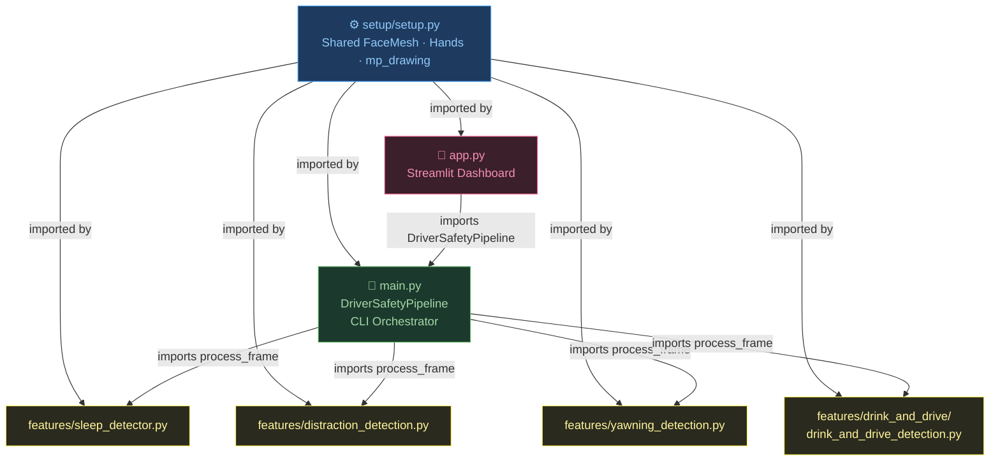

<div align="center">

# 🚗 Driver Drowsiness & Distraction Detector

**A real-time, multi-signal safety system that detects driver drowsiness, distraction, yawning, and drink-while-driving behavior using computer vision — and raises an alarm before an accident happens.**

[](https://www.python.org/)
[](https://opencv.org/)
[](https://mediapipe.dev/)
[](https://ultralytics.com/)
[](https://streamlit.io/)
[](LICENSE)
[]()
[](CONTRIBUTING.md)

</div>

<<<<<<< HEAD
### System Requirements

- Python 3.8 or higher
- Webcam or camera device
- Minimum 4GB RAM recommended

### Python Dependencies

Install the required packages using:

```bash
pip install -r requirements.txt
```

**Main Dependencies:**

- `opencv-python>=4.5.0` - Computer vision and image processing
- `numpy>=1.20.0` - Numerical computing
- `mediapipe>=0.8.10` - Face mesh detection and facial landmark tracking
- `pygame>=2.0.0` - Audio playback for alarms
- `matplotlib>=3.4.0` - Plotting and visualization
=======
---

## 📋 Table of Contents

1. [Key Features](#-key-features)
2. [Tech Stack](#-tech-stack)
3. [System Architecture & Logic](#-system-architecture--logic)
4. [Getting Started](#-getting-started)
   - [Prerequisites](#prerequisites)
   - [Installation](#installation)
   - [Configuration](#configuration)
5. [Usage](#-usage)
6. [Project Structure](#-project-structure)
7. [Performance & Optimization](#-performance--optimization)
8. [Troubleshooting](#-troubleshooting)
9. [Contributing](#-contributing)
10. [License](#-license)
11. [Contact](#-contact)

---

## ✨ Key Features

- 🖥️ **Unified Dashboard** — Streamlit-based live dashboard runs all four detectors on a single camera feed simultaneously
- 👁️ **Real-time Drowsiness Detection** — Eye Aspect Ratio (EAR) with smoothed temporal averaging to eliminate flicker and false positives
- 🔄 **Head Pose Estimation** — Computes calibrated yaw, pitch, and roll from facial landmarks using vector cross-product geometry
- 👀 **Iris Gaze Tracking** — Detects off-centre gaze by tracking iris position relative to eye corners (MediaPipe Iris)
- 😮 **Yawning Detection** — Mouth Aspect Ratio (MAR) + eye closure overlap + hand-near-mouth scoring with cooldown logic
- 🍺 **Drink-While-Driving Detection** — YOLOv8n object detection fused with hand-proximity signals and a 4-state machine (IDLE → POSSIBLE → DRINKING → ALERT)
- 🔗 **Multi-Signal Fusion** — Weighted risk scoring combines EAR, gaze, head pose, drink object confidence, and hand-to-mouth distance
- 🧩 **DRY Modular Architecture** — Shared MediaPipe setup (`setup/setup.py`), per-feature `process_frame()` functions, pure orchestrator entry point
- 🔔 **Audio Alarms** — Synthesized dual-frequency beep or custom `.wav` file via Pygame mixer
- 🎛️ **Highly Configurable** — 40+ parameters in `config/config.py`; no code changes needed to tune thresholds
- 📋 **Event Logging** — CSV-format drowsiness and drink-event logs with optional frame snapshots
- 🐞 **Debug Mode** — Live facial mesh overlay, EAR values, and frame counter on-screen
- ⌨️ **Keyboard Shortcuts** — Toggle debug mode, reset counters, re-calibrate head pose at runtime
- 🔁 **Auto-Calibration** — Neutral head pose captured on first frame; press `c` anytime to re-calibrate

---

## 🛠️ Tech Stack

### Core Vision & ML

| Library | Version | Role |
|---|---|---|
| **OpenCV** | ≥ 4.5.0 | Camera capture, frame processing, drawing overlays |
| **MediaPipe** | ≥ 0.8.10 | 468-point FaceMesh, Iris landmarks, Hand tracking |
| **Ultralytics YOLOv8** | ≥ 8.0.0 | Real-time drink object detection (YOLOv8n backbone) |
| **NumPy** | ≥ 1.20.0 | Vector math, EAR calculations, angle geometry |

### Dashboard & Utilities

| Library | Version | Role |
|---|---|---|
| **Streamlit** | ≥ 1.28.0 | Real-time web dashboard with live camera feed |
| **Pygame** | ≥ 2.0.0 | Audio mixer, alarm sound synthesis & playback |
| **Matplotlib** | ≥ 3.4.0 | EAR trend plots, dataset visualisation |
| **Pillow** | ≥ 8.0.0 | Image I/O for dataset management |
| **icrawler** | ≥ 0.6.0 | Automated Bing image scraping for training data |
| **scikit-learn** | ≥ 1.0.0 | Dataset splitting, model evaluation metrics |

### Language & Environment

- **Python 3.8+** — Core runtime
- **Virtual Environment** (`venv`) — Dependency isolation

---

## 🧠 System Architecture & Logic

The system follows a **DRY modular architecture** where a single shared MediaPipe setup feeds all four feature detectors through one orchestrator.

#### Module & Import Structure



#### Per-Frame Detection Pipeline
>>>>>>> 2fc91912102771d4f20ac729f380e3c140484d52

```mermaid
flowchart LR
    CAM["📷 Camera\nframe"]
    MP["🧠 MediaPipe\nOne shared pass\nFaceMesh + Hands"]
    LMS["face_landmarks\nhand_results"]

<<<<<<< HEAD
### 1. Clone or Download the Repository

=======
    SLEEP["💤 sleep_detector\nprocess_frame\nEAR → Drowsiness"]
    DIST["👁️ distraction_detection\nprocess_frame\nGaze + Head Pose"]
    YAWN["😮 yawning_detection\nprocess_frame\nMAR + Score"]
    DRINK["🍺 drink_and_drive\nprocess_frame\nYOLO + State Machine"]

    ALARM["🔔 Alarm\n+ Overlay\n+ Log"]

    CAM --> MP
    MP --> LMS
    LMS --> SLEEP
    LMS --> DIST
    LMS --> YAWN
    LMS --> DRINK

    SLEEP -->|drowsy| ALARM
    DIST -->|distracted| ALARM
    YAWN -->|yawning| ALARM
    DRINK -->|ALERT state| ALARM

    style CAM fill:#263238,color:#eceff1,stroke:#546e7a
    style MP fill:#1e3a5f,color:#90caf9,stroke:#42a5f5
    style LMS fill:#1e3a5f,color:#90caf9,stroke:#42a5f5
    style SLEEP fill:#1b3a2d,color:#a5d6a7,stroke:#66bb6a
    style DIST fill:#1b3a2d,color:#a5d6a7,stroke:#66bb6a
    style YAWN fill:#1b3a2d,color:#a5d6a7,stroke:#66bb6a
    style DRINK fill:#1b3a2d,color:#a5d6a7,stroke:#66bb6a
    style ALARM fill:#4a1010,color:#ef9a9a,stroke:#e53935
```

### Key Algorithms

#### 1. Eye Aspect Ratio (EAR)
```
EAR = (Mean upper eyelid Y − Mean lower eyelid Y) / Eye width
```
- 16 landmarks per eye are averaged into upper/lower groups
- A rolling 5-frame average smooths out noise
- Alarm fires after `EYE_AR_CONSEC_FRAMES` consecutive frames below threshold

#### 2. Head Pose via Vector Cross-Product
```
eye_vector  = right_eye − left_eye          (normalized)
vert_vector = mouth_center − nose           (normalized)
face_normal = eye_vector × vert_vector      (looking direction)

yaw   = arctan2(face_normal.x, face_normal.z)
pitch = arctan2(−face_normal.y, face_normal.z)
roll  = arctan2(eye_vector.y, eye_vector.x)
```
All angles are **relative to the calibrated neutral** captured on startup (or re-calibrated with `c`). No hardcoded camera offsets.

#### 3. Iris Gaze Ratio
```
gaze_ratio = (iris_x − outer_corner_x) / (inner_corner_x − outer_corner_x)
```
- 0.0 = fully toward outer corner, 0.5 = centred, 1.0 = fully toward inner
- Division-by-zero guarded; falls back to 0.5 if landmarks overlap

#### 4. Yawning Detection (Score-Based)
```
score = (1.0 if mouth_open ≥ MIN_YAWN_DURATION)
      + (1.0 if eye_closed_overlap ≥ MIN_EYE_CLOSED_OVERLAP)
      + (0.25 if hand_near_mouth)
```
Yawn is confirmed when `score ≥ 2.0`. Cooldown timer prevents duplicate counting.

#### 5. Drink-Drive Signal Fusion
```
risk_score = (drink_conf × 1.0) + (hand_proximity × 1.0) + (head_distraction × 0.5)
```
State machine transitions require the risk score to exceed a threshold **for N consecutive frames**, preventing single-frame noise from triggering alerts.

---

## 🚀 Getting Started

### Prerequisites

| Requirement | Minimum Version | Notes |
|---|---|---|
| Python | 3.8 | 3.10+ recommended |
| Webcam | Any | Built-in or USB; 720p+ preferred |
| RAM | 4 GB | 8 GB recommended for YOLOv8 training |
| OS | Windows / Linux / macOS | Tested on Windows 11 |

### Installation

**1. Clone the repository**
>>>>>>> 2fc91912102771d4f20ac729f380e3c140484d52
```bash
git clone https://github.com/nikes303/Driver_Drowsiness_Detector.git
cd Driver_Drowsiness_Detector
```

<<<<<<< HEAD
### 2. Create a Virtual Environment (Recommended)

=======
**2. Create and activate a virtual environment**
>>>>>>> 2fc91912102771d4f20ac729f380e3c140484d52
```bash
# Windows
python -m venv drowsy_env
drowsy_env\Scripts\activate

# Linux / macOS
python -m venv drowsy_env
source drowsy_env/bin/activate
```

<<<<<<< HEAD
### 3. Install Dependencies

=======
**3. Install dependencies**
>>>>>>> 2fc91912102771d4f20ac729f380e3c140484d52
```bash
pip install -r requirements.txt
```

<<<<<<< HEAD
### 4. Verify Installation

Run the installation test to ensure all dependencies are properly installed:

=======
**4. Verify installation**
>>>>>>> 2fc91912102771d4f20ac729f380e3c140484d52
```bash
python test_installation.py
```

<<<<<<< HEAD
## Usage

### Basic Usage

Start the drowsiness detection system with default settings:

```bash
python sleep_detector.py
```

Start the distraction detection system :

```bash
python distraction_detector.py
```

### Advanced Options
=======
Expected output:
```
✔ Camera test passed
✔ MediaPipe Face Mesh test passed
✔ Pygame audio test passed
[SUCCESS] All tests passed! System is ready.
```

> **MediaPipe version issue?** Run:
> ```bash
> pip uninstall mediapipe && pip install mediapipe==0.10.9
> ```

---

### Configuration

All system parameters live in **`config/config.py`** — no code edits needed for normal tuning.

```python
# ── Core Drowsiness ──────────────────────────────────────────────────────────
EYE_AR_THRESHOLD       = 0.22   # EAR below this = eyes closed
EYE_AR_CONSEC_FRAMES   = 25     # frames closed before alarm (~0.83 s @ 30 fps)

# ── Hardware ─────────────────────────────────────────────────────────────────
CAMERA_INDEX  = 0               # 0 = default webcam; try 1, 2 for others
FRAME_WIDTH   = 640
FRAME_HEIGHT  = 480

# ── Distraction Detection ────────────────────────────────────────────────────
GAZE_CENTER_MIN           = 0.35   # gaze ratio band; outside = looking away
GAZE_CENTER_MAX           = 0.65
HEAD_YAW_LIMIT            = 15     # degrees left/right (tightened)
HEAD_PITCH_LIMIT          = 6      # degrees up/down (tightened)
HEAD_ROLL_LIMIT           = 12     # degrees sideways tilt
DISTRACTION_CONSEC_FRAMES = 10     # frames before distraction warning (~0.33 s)

# ── Yawning Detection ───────────────────────────────────────────────────────
MAR_THRESHOLD             = 0.6    # mouth aspect ratio threshold
EAR_THRESHOLD             = 0.21   # eye closure threshold for yawn scoring
MIN_YAWN_DURATION         = 1.5    # seconds mouth must stay open
YAWN_COOLDOWN             = 3.0    # seconds between counted yawns

# ── Alerts ───────────────────────────────────────────────────────────────────
ALARM_SOUND  = "alarm.wav"      # path to WAV file, or None for generated beep
ALARM_VOLUME = 0.9              # 0.0 – 1.0

# ── Drink Detection ──────────────────────────────────────────────────────────
DRINK_RISK_THRESHOLD_IDLE_TO_POSSIBLE    = 0.4
DRINK_RISK_THRESHOLD_POSSIBLE_TO_CONFIRMED = 0.9
DRINK_RISK_THRESHOLD_CONFIRMED_TO_ALERT    = 1.3
```

---

## 📖 Usage

### 🖥️ Unified Dashboard (Recommended)

Run **all four detectors simultaneously** on a single camera feed:
>>>>>>> 2fc91912102771d4f20ac729f380e3c140484d52

```bash
# CLI mode (OpenCV window)
python main.py

# Streamlit web dashboard (with live metrics, toggles, and alert history)
streamlit run app.py
```

**Dashboard features:**
- ▶/⏹ Start/Stop buttons
- Per-detector toggle checkboxes (Drowsiness, Distraction, Yawning, Drink & Drive)
- Real-time metric cards with severity coloring (green/orange/red)
- Alert banner + scrollable alert history log
- Silent mode toggle
- Head pose recalibration button

### Individual Feature Modules (Standalone)

<<<<<<< HEAD
### Eye Detection Parameters

- `EYE_AR_THRESHOLD`: Eye Aspect Ratio threshold (default: 0.22)
  - Lower values = More sensitive (detects slightly closed eyes)
  - Higher values = Less sensitive (only detects fully closed eyes)
- `EYE_AR_CONSEC_FRAMES`: Consecutive frames of closed eyes to trigger alarm (default: 25)
  - At 30 FPS, this equals ~0.83 seconds

### Hardware Settings

- `CAMERA_INDEX`: Camera device index (0 = default webcam)
- `FRAME_WIDTH`: Video frame width (default: 640)
- `FRAME_HEIGHT`: Video frame height (default: 480)

### Alert Settings

- `ALARM_SOUND`: Path to custom alarm sound file (WAV format)
- `ALARM_VOLUME`: Alert volume level (0.0 = silent, 1.0 = maximum, default: 0.9)

### UI Settings

- `SHOW_EAR_VALUE`: Display EAR value on screen (default: True)
- `SHOW_LANDMARKS`: Show facial landmarks visualization (default: True)
- `TEXT_COLOR`: Color for text overlays (BGR format)
- `FRAME_COLOR`: Color for face frame (BGR format)

### Logging Settings

- `ENABLE_LOGGING`: Enable event logging (default: False)
- `LOG_FILE`: Path to log file (default: "sleep_detection_log.txt")
=======
Each feature module can still be run independently:

```bash
# Drowsiness Detection
python features/sleep_detector.py
python features/sleep_detector.py --ear 0.18 --seconds 1.5 --debug

# Distraction Detection
python features/distraction_detection.py

# Yawning Detection
python features/yawning_detection.py

# Drink-While-Driving Detection
python features/drink_and_drive/drink_and_drive_detection.py
```
>>>>>>> 2fc91912102771d4f20ac729f380e3c140484d52

### Training a Custom Drink Detector

```bash
# Step 1 — Download training images from web
python features/drink_and_drive/drink_detector_trainer.py --mode download_web

# Step 2 — Train YOLOv8n on collected dataset
python features/drink_and_drive/drink_detector_trainer.py --mode train --dataset_path ./drink_dataset

# Step 3 — Live test with the trained model
python features/drink_and_drive/drink_detector_trainer.py --mode test_camera --model_path ./drink_detector_yolov8n.pt

# Step 4 — Evaluate performance metrics
python features/drink_and_drive/drink_detector_trainer.py --mode evaluate --model_path ./drink_detector_yolov8n.pt
```

### Keyboard Shortcuts

#### CLI mode (`python main.py`)

| Key | Action |
|-----|--------|
| `q` / `ESC` | Quit the application |
| `r` | Reset all counters and alarms |
| `c` | Re-calibrate neutral head pose |

#### Standalone modules

<<<<<<< HEAD
| Key | Action                                         |
| --- | ---------------------------------------------- |
| `q` | Quit the application                           |
| `d` | Toggle debug mode (show/hide facial landmarks) |
| `r` | Reset counters and alarms                      |

## Project Structure

```
Driver_Drowsiness_Detector/
├── sleep_detector.py           # Main drowsiness detection module
├── distraction_detection.py    # Head position and gaze tracking
├── utils.py                    # Utility functions and helpers
├── config.py                   # Configuration parameters
├── test_installation.py        # Installation verification script
├── requirements.txt            # Python dependencies
└── README.md                   # This file
```

### File Descriptions

**sleep_detector.py**

- Main entry point for the drowsiness detection system
- Initializes MediaPipe face mesh and camera capture
- Implements Eye Aspect Ratio (EAR) calculation
- Manages alarm triggering logic and frame processing loop

**distraction_detection.py**

- Head rotation metrics and pose estimation
- Gaze direction detection
- Determines if driver is looking away from road
- Computes yaw, pitch, and roll angles

**utils.py**

- Utility functions for alarm playback
- Event logging functionality
- Frame resizing and preprocessing
- Eye closure detection helpers
- Audio generation for alarm beeps

**config.py**

- Centralized configuration for all system parameters
- Well-documented settings with explanations
- Easy adjustment without code modification

## How It Works

### 1. Face Detection

The system uses MediaPipe's FaceMesh to detect 468 facial landmarks in real-time with high accuracy.

### 2. Eye Landmark Extraction

Specific landmarks are extracted for:

- **Left Eye**: 16 key points defining eye contour
- **Right Eye**: 16 key points defining eye contour

### 3. Eye Aspect Ratio (EAR) Calculation

EAR = (Distance between upper and lower eyelid) / (Width of eye)

- High EAR (>0.22) = Eyes Open
- Low EAR (<0.22) = Eyes Closed

### 4. Drowsiness Detection Logic

- If EAR < threshold for consecutive frames → Drowsiness detected
- Number of consecutive frames is configurable
- Audio alarm triggers when drowsiness is detected

### 5. Distraction Detection

- Monitors head rotation (yaw, pitch, roll angles)
- Tracks iris position within eye bounds
- Flags when driver looks away from forward direction

## Tips for Best Performance

1. **Lighting**: Ensure adequate lighting on the driver's face for optimal detection
2. **Camera Position**: Mount camera at eye level, 12-18 inches from face
3. **Threshold Tuning**: Start with default values and adjust based on testing
4. **Eye Shape**: Sensitivity varies by eye shape; test individual thresholds
5. **Framerate**: Better performance with 30+ FPS; adjust resolution if needed
6. **Environmental**: Avoid direct sunlight and reflections on the camera lens

## Troubleshooting

### Camera Not Found

- Verify the camera index using `--camera` parameter (try 0, 1, 2, etc.)
- Check camera permissions in system settings
- Restart the application

### False Alarms (Too Sensitive)

- Increase `EYE_AR_THRESHOLD` in config.py (e.g., 0.24, 0.25)
- Increase `EYE_AR_CONSEC_FRAMES` value
- Ensure bright lighting on the face

### Missing Alarms (Too Insensitive)

- Decrease `EYE_AR_THRESHOLD` in config.py (e.g., 0.20, 0.19)
- Reduce `EYE_AR_CONSEC_FRAMES` value
- Check lighting conditions

### Mediapipe error fix

```
pip uninstall mediapipe
pip install mediapipe==0.10.9
```

### Camera Freezing

- Reduce `FRAME_WIDTH` and `FRAME_HEIGHT` in config.py
- Close other applications using the camera
- Use `--fps-skip` if available

### No Audio Output

- Check volume settings on your system
- Verify pygame mixer initialization
- Try `--silent` mode to test without audio

## Dependencies Details

### MediaPipe

- Provides 468 high-accuracy facial landmarks
- Real-time face detection on CPU
- Robust to various head poses and lighting

### OpenCV

- Video capture and frame processing
- Image transformations and visualization
- Real-time video rendering

### NumPy

- Numerical computations for EAR calculations
- Distance and angle computations
- Array processing

### Pygame

- Audio playback for alarm sounds
- Sound generation for beep tones

## Performance Metrics

- **Detection Latency**: <100ms (varies by hardware)
- **False Positive Rate**: <5% (with proper calibration)
- **False Negative Rate**: <3% (with proper calibration)
- **CPU Usage**: 15-30% on modern systems
- **Memory Usage**: 200-400MB

## Future Enhancements

- Support for multiple driver detection
- Machine learning model for fatigue prediction
- Cloud-based alert system
- Mobile application integration
- Driver profile customization
- Advanced gaze tracking

## Contributing

Contributions are welcome! Please feel free to:

- Report bugs and issues
- Suggest improvements
- Submit pull requests with enhancements
- Improve documentation

## Support

For issues, questions, or feedback:

1. Check the Troubleshooting section
2. Review configuration parameters
3. Run test_installation.py to verify setup
4. Check system requirements

## Disclaimer

This system is intended as a safety aid and should not be relied upon as the sole method for preventing drowsy driving. Always ensure proper rest before driving and follow all traffic safety regulations.
=======
| Key | Action |
|-----|--------|
| `q` | Quit the application |
| `d` | Toggle debug mode (show/hide face mesh) |
| `r` | Reset counters and alarms |
| `c` | Re-calibrate neutral head pose *(distraction module)* |
>>>>>>> 2fc91912102771d4f20ac729f380e3c140484d52

---

## 📁 Project Structure

```
Driver_Drowsiness_Detector/
│
├── 📄 main.py                              # Pure orchestrator — imports process_frame() from each feature
├── 📄 app.py                               # Streamlit dashboard — imports DriverSafetyPipeline from main.py
│
├── 📁 setup/                               # Shared MediaPipe resources (DRY)
│   ├── __init__.py
│   └── setup.py                            # Single FaceMesh + Hands instance for all modules
│
├── 📁 config/
│   └── config.py                           # Centralised configuration (40+ params)
│
├── 📁 utils/
│   └── utils.py                            # Shared utilities: alarm, EAR/MAR, logging, risk scoring
│
├── 📁 features/                            # Feature modules — each has main() + process_frame()
│   ├── sleep_detector.py                   # Drowsiness detection (EAR + smoothing + alarm)
│   ├── distraction_detection.py            # Gaze tracking + head pose + off-centre detection
│   ├── yawning_detection.py                # MAR + eye overlap + hand proximity yawn scoring
│   └── 📁 drink_and_drive/
│       ├── drink_and_drive_detection.py     # 4-state machine drink-drive detector
│       ├── drink_detector_trainer.py        # YOLOv8 training pipeline
│       ├── yolov8_drink_detector.py         # YOLOv8 detector class (clean interface)
│       └── image_downloader.py             # Automated Bing dataset scraper (icrawler)
│
├── 📁 models/                              # Trained model weights (git-ignored)
│   └── yolov8n_drink.pt
│
├── 🧪 test_installation.py                # Dependency & camera verification
├── 📋 requirements.txt
└── 📖 README.md
```

### Architecture Principles

- **DRY (Don't Repeat Yourself)** — MediaPipe setup exists once in `setup/setup.py`; all modules import from it
- **Separation of Concerns** — Feature modules contain logic, utils contain helpers, entry points contain orchestration
- **Scalability** — Adding a new detector: create `features/new_detector.py` with `process_frame()`, import it in `main.py`
- **Backward Compatibility** — Each feature's `main()` still works standalone with `python features/<module>.py`

---

## ⚡ Performance & Optimization

| Metric | Value | Notes |
|---|---|---|
| **End-to-end latency** | < 100 ms | MediaPipe + EAR on CPU |
| **YOLOv8n inference** | < 50 ms / frame | CPU; GPU further reduces this |
| **False positive rate** | < 5% | With proper lighting & calibration |
| **False negative rate** | < 3% | With proper lighting & calibration |
| **CPU usage** | 15 – 30% | Modern quad-core |
| **RAM usage** | 200 – 400 MB | Without GPU memory |

### Optimization Techniques Used

- **Shared MediaPipe instances** — One `FaceMesh` + one `Hands` instance processes each frame; results shared across all 4 detectors
- **EAR temporal smoothing** — 5-frame rolling average; eliminates single-frame blink noise
- **Consecutive-frame counters** — All alerts require N sustained frames; prevents flicker
- **YOLOv8 Nano backbone** — Smallest YOLO variant; maximises FPS on CPU
- **Single face tracking** — `max_num_faces=1` in FaceMesh reduces compute
- **Frame skipping fallback** — Graceful degradation if camera drops frames
- **Flicker-free Streamlit feed** — `while`-loop with `st.empty()` placeholder updates instead of `st.rerun()`

### Tips for Best Performance

1. **Lighting** — Ensure even, bright illumination on the driver's face
2. **Camera placement** — Eye level, 30–45 cm from face
3. **Resolution** — Use `640×480` default; lower if CPU-bound
4. **Calibration** — Press `c` after the driver adjusts their seating position
5. **Threshold tuning** — Start with defaults, then adjust `EYE_AR_THRESHOLD` ±0.02

---

## 🔧 Troubleshooting

| Problem | Solution |
|---|---|
| **Camera not found** | Try `--camera 1` or `--camera 2`; change `CAMERA_INDEX` in config |
| **Too many false alarms** | Raise `EYE_AR_THRESHOLD` to 0.24–0.25; improve lighting |
| **Alarms not triggering** | Lower `EYE_AR_THRESHOLD` to 0.19–0.20; check lighting |
| **MediaPipe import error** | `pip uninstall mediapipe && pip install mediapipe==0.10.9` |
| **Camera freezes** | Reduce `FRAME_WIDTH`/`FRAME_HEIGHT` in `config/config.py` |
| **No audio output** | Check system volume; use Silent Mode to confirm visual-only works |
| **Head pose always "DISTRACTED"** | Press `c` / click Recalibrate with face looking straight ahead |
| **Streamlit video blinking** | Ensure you're using Streamlit ≥ 1.28; the app uses `while`-loop (not `st.rerun()`) |
| **`use_container_width` warning** | Update Streamlit to latest version; app uses `width='stretch'` |


---

## 📄 License

This project is licensed under the **MIT License** — see the [LICENSE](LICENSE) file for details.

```
MIT License — free to use, modify, and distribute with attribution.
```

---

## 📬 Contact

**icemberg** — Primary Developer
- 🐙 GitHub: [@icemberg](https://github.com/icemberg)

**nikes303** — Contributor
- 🐙 GitHub: [@nikes303](https://github.com/nikes303)

> Project Repository: [https://github.com/nikes303/Driver_Drowsiness_Detector](https://github.com/nikes303/Driver_Drowsiness_Detector)

---

<div align="center">

⚠️ **Disclaimer** — This system is a safety *aid* and should never replace adequate rest before driving. Always follow traffic safety regulations.

*Built with ❤️ using MediaPipe, OpenCV, YOLOv8 & Streamlit*

</div>
